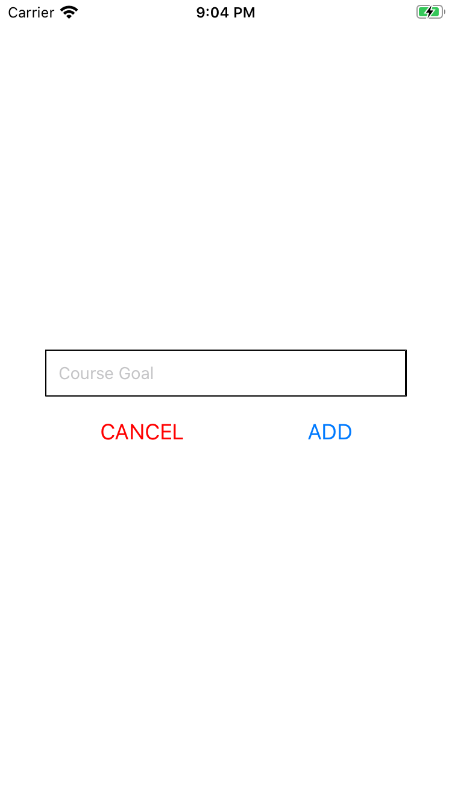
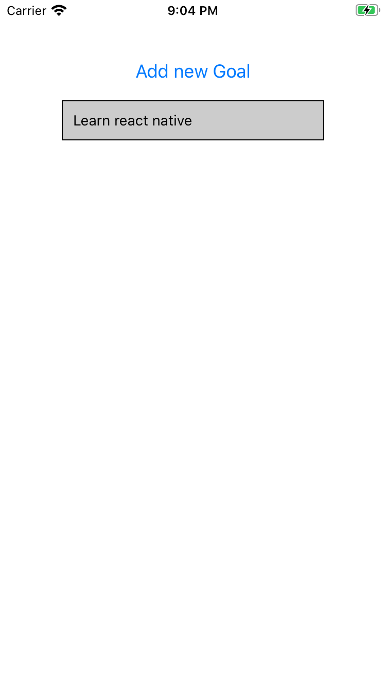
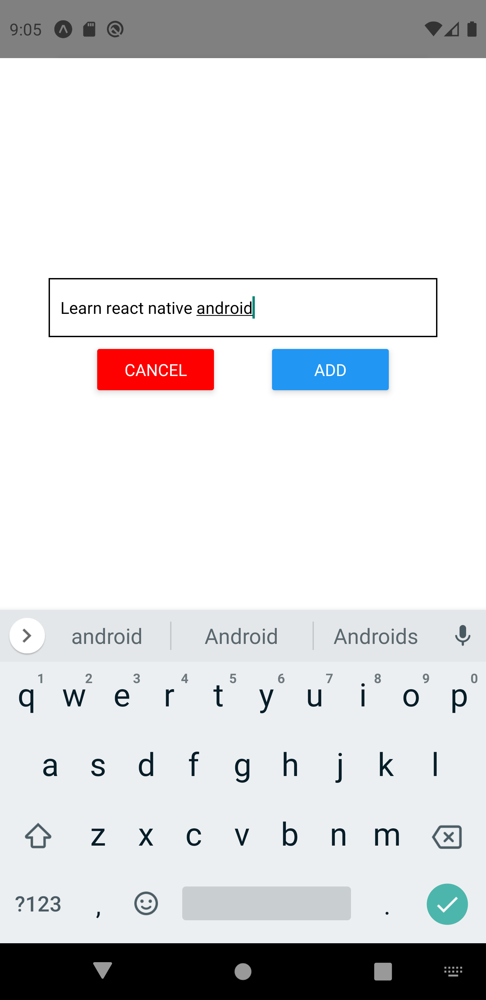

# basic_react_nativeapp
State, functional components, and styling

This is a basic react native application the showcase components, javascript styling, and functions.

  

  

  

  

  

  
  

